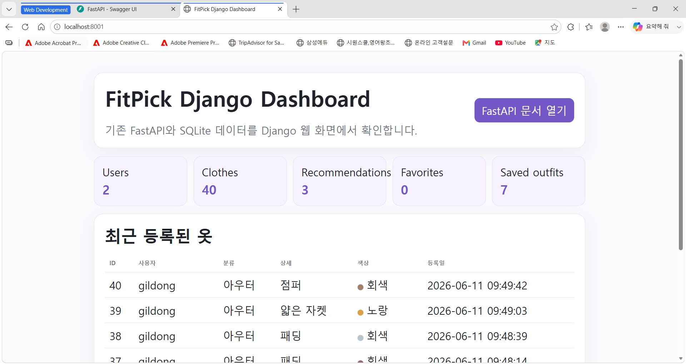
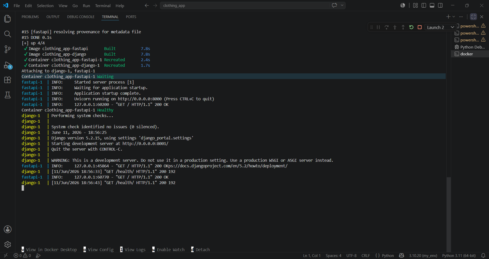
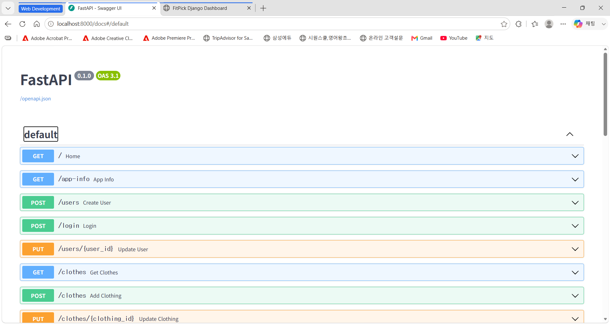

# FitPick 핏픽 개발자 가이드

> FastAPI 사용자 API + Django 관리자 대시보드 + Docker Compose 실행 구조

이 문서는 FitPick 프로젝트를 유지보수하거나 확장하는 개발자를 위한 문서입니다. 프로젝트 구조, 실행 환경, 서버 구성, 데이터베이스, API, 추천 로직, Docker 실행 방식, 관리자 대시보드 구조를 설명합니다.

---

## 1. 프로젝트 개요

FitPick은 사용자가 등록한 옷과 사용자 정보를 기반으로 맞춤 코디를 추천하는 Python 프로젝트입니다. 사용자 화면은 Flet으로 구성되어 있고, 사용자 기능은 FastAPI 서버가 처리합니다. Django 대시보드는 같은 SQLite 데이터베이스를 조회하여 관리자용 통계 화면을 제공합니다.

핵심 구성은 다음과 같습니다.

```text
Flet 사용자 앱
  ↓ HTTP 요청
FastAPI 서버 : localhost:8000
  ↓ SQLite 저장/조회
SQLite DB : clothes.db
  ↑ SQLite 조회
Django 관리자 대시보드 : localhost:8001
```

---

## 2. 기술 스택

| 구분 | 기술 |
| --- | --- |
| 언어 | Python |
| 사용자 UI | Flet |
| 사용자 API 서버 | FastAPI, Uvicorn |
| 관리자 웹 서버 | Django |
| 데이터베이스 | SQLite |
| 이미지 처리 | Pillow |
| HTTP 통신 | requests |
| 데이터 검증 | Pydantic |
| 컨테이너 실행 | Docker, Docker Compose |
| 버전 관리 | Git, GitHub |

---

## 3. 설치 및 실행

### 3.1 패키지 설치

```bash
pip install -r requirements.txt
```

requirements 설치가 안 되면 필요한 패키지를 직접 설치합니다.

```bash
pip install flet fastapi uvicorn django requests pillow pydantic
```

### 3.2 Flet 앱 실행

```bash
python run_app.py
```

### 3.3 Docker Compose 서버 실행

```bash
docker compose up --build
```

확인 주소는 다음과 같습니다.

| 주소 | 역할 |
| --- | --- |
| http://localhost:8000/ | FastAPI 서버 상태 확인 |
| http://localhost:8000/docs | FastAPI Swagger 문서 |
| http://localhost:8001 | Django 관리자 대시보드 |
| http://localhost:8001/health/ | Django 상태 확인 API |

서버 종료:

```bash
docker compose down
```

---

## 4. 프로젝트 구조

```text
clothing_app/
  run_app.py
  main.py
  api_client.py
  backend_runner.py
  app_paths.py
  docker-compose.yml
  Dockerfile
  manage.py
  requirements.txt

  backend/
    app.py
    database.py
    schemas.py
    outfit_logic.py

  django_portal/
    settings.py
    urls.py
    wsgi.py

  django_dashboard/
    apps.py
    urls.py
    views.py
    templates/
      django_dashboard/
        dashboard.html

  logic/
    color_logic.py
    image_logic.py
    recommend_logic.py

  model/
    clothing.py
    user.py

  views/
    auth_view.py
    home_view.py
    register_view.py
    clothes_view.py
    recommend_view.py
    profile_view.py
    base_recommend_view.py
    theme.py
    components.py

  app_data/
    images/
```

---

## 5. Flet 앱 구조

`main.py`는 Flet 앱의 메인 진입점입니다. 주요 역할은 다음과 같습니다.

- Flet 페이지 설정
- 백엔드 자동 실행 시도
- 전역 상태 관리
- 사용자 정보 관리
- 옷 목록 로드
- 저장 코디 로드
- 화면 라우팅
- 햄버거 메뉴 처리

전역 상태 예시는 다음과 같습니다.

```python
app_state = {
    "user": None,
    "current_user": None,
    "clothes": [],
    "saved_outfits": [],
}
```

주요 라우트는 다음과 같습니다.

| 라우트 | 화면 |
| --- | --- |
| `/login` | 로그인 |
| `/signup` | 회원가입 |
| `/home` | 홈 |
| `/register` | 옷 등록 방식 선택 |
| `/register_photo` | 사진으로 등록 |
| `/register_direct` | 직접 등록 |
| `/clothes` | 등록된 옷 확인 |
| `/recommend` | 맞춤 코디 추천 |
| `/coordination` | 코디해보기 |
| `/temperature` | 온도 추천 |
| `/today` | 오늘의 추천 코디 |
| `/personal` | 사용자 맞춤 코디 |
| `/base_recommend` | 색상 기반 추천 |
| `/outfit` | 나의 코디 확인 |
| `/profile` | 사용자 정보 |

---

## 6. FastAPI 백엔드 구조

FastAPI 백엔드는 `backend/app.py`에서 정의됩니다.

주요 기능은 다음과 같습니다.

- 회원가입
- 로그인
- 사용자 정보 수정
- 옷 등록/조회/수정/삭제
- 코디 평가
- 추천 기록 조회
- 즐겨찾기 추가/조회
- 색상 추천
- 개별 옷 기반 추천
- 저장 코디 등록/조회/삭제

---

## 7. 데이터베이스 구조

SQLite 데이터베이스는 `backend/database.py`에서 초기화됩니다.

### 7.1 users

| 컬럼 | 설명 |
| --- | --- |
| `user_id` | 사용자 아이디 |
| `password` | 비밀번호 해시 |
| `name` | 이름 |
| `gender` | 성별 |
| `height` | 키 |
| `weight` | 몸무게 |
| `body_type` | 체형 |
| `skin_tone` | 피부톤 |
| `personal_color` | 퍼스널 컬러 |
| `styles` | 선호 스타일 JSON |
| `created_at` | 생성일 |

### 7.2 clothes

| 컬럼 | 설명 |
| --- | --- |
| `id` | 옷 ID |
| `user_id` | 소유 사용자 |
| `category` | 카테고리 |
| `detail` | 세부 종류 |
| `feature` | 특징 |
| `color_name` | 색상 이름 |
| `color_hex` | HEX 색상 코드 |
| `image_path` | 이미지 경로 |
| `created_at` | 등록일 |

### 7.3 recommend_history

추천 평가 결과를 저장합니다.

| 컬럼 | 설명 |
| --- | --- |
| `id` | 추천 기록 ID |
| `user_id` | 사용자 아이디 |
| `input_data` | 입력 데이터 JSON |
| `result_data` | 결과 데이터 JSON |
| `score` | 총점 |
| `reason` | 추천 이유 |
| `created_at` | 생성일 |

### 7.4 favorites

추천 기록 즐겨찾기 정보를 저장합니다.

### 7.5 saved_outfits

사용자가 저장한 코디 정보를 저장합니다.

| 컬럼 | 설명 |
| --- | --- |
| `id` | 저장 코디 ID |
| `user_id` | 사용자 아이디 |
| `outfit_data` | 저장 코디 JSON |
| `created_at` | 저장일 |

---

## 8. API 명세

| 메서드 | 경로 | 기능 |
| --- | --- | --- |
| `GET` | `/` | 서버 상태 확인 |
| `GET` | `/app-info` | 앱 경로 및 DB 경로 확인 |
| `POST` | `/users` | 회원가입 |
| `POST` | `/login` | 로그인 |
| `PUT` | `/users/{user_id}` | 사용자 정보 수정 |
| `GET` | `/clothes` | 옷 목록 조회 |
| `POST` | `/clothes` | 옷 등록 |
| `PUT` | `/clothes/{clothing_id}` | 옷 수정 |
| `DELETE` | `/clothes/{clothing_id}` | 옷 삭제 |
| `POST` | `/evaluate-outfit` | 코디 평가 |
| `GET` | `/history` | 추천 이력 조회 |
| `POST` | `/favorite/{history_id}` | 즐겨찾기 추가 |
| `GET` | `/favorites` | 즐겨찾기 조회 |
| `POST` | `/recommend-from-photo` | 사진 기반 색상 추천 |
| `POST` | `/recommend-by-cloth` | 개별 옷 기반 색상 추천 |
| `POST` | `/saved-outfits` | 저장 코디 등록 |
| `GET` | `/saved-outfits` | 저장 코디 조회 |
| `DELETE` | `/saved-outfits/{outfit_id}` | 저장 코디 삭제 |

---

## 9. Django 관리자 대시보드

Django 대시보드는 `django_dashboard` 앱에서 구현됩니다. FastAPI와 같은 SQLite DB를 읽어서 관리자용 통계를 보여줍니다.

현재 확인 가능한 정보는 다음과 같습니다.

- 전체 사용자 수
- 등록된 옷 수
- 추천 기록 수
- 즐겨찾기 수
- 저장 코디 수
- 최근 등록된 옷 목록



---

## 10. 추천 알고리즘 구조

추천 알고리즘은 등록된 옷을 카테고리별로 분류하고 가능한 코디 조합을 만든 뒤 점수를 계산합니다.

평가 요소는 다음과 같습니다.

| 요소 | 설명 |
| --- | --- |
| 색상 조합 | 상의, 하의, 아우터, 신발 간 색상 조화 평가 |
| 온도 적합도 | 현재 기온에 맞는 옷 두께와 계절감 반영 |
| 체형 보완 | 체형에 맞는 핏과 실루엣 반영 |
| 퍼스널 컬러 | 사용자 퍼스널 컬러와 옷 색상 매칭 |
| 선호 스타일 | 선택한 스타일과 옷 특징 매칭 |
| 상황 적합도 | 데일리, 출근, 데이트 등 상황 반영 |
| 완성도 | 상하의, 아우터, 신발, 악세서리 조합 완성도 |

추천 흐름은 다음과 같습니다.

```text
사용자 정보 로드
  ↓
등록된 옷 목록 로드
  ↓
카테고리별 옷 분리
  ↓
가능한 코디 조합 생성
  ↓
색상·온도·체형·퍼스널컬러·스타일 점수 계산
  ↓
총점 기준 정렬
  ↓
TOP3 추천 결과 반환
```


---

## 11. Docker Compose 실행 결과

Docker Compose를 통해 FastAPI 컨테이너와 Django 컨테이너를 동시에 실행합니다.



FastAPI Swagger 문서는 다음 화면에서 확인할 수 있습니다.



---

## 12. 테스트 및 디버깅

### 12.1 서버 상태 확인

```bash
curl http://localhost:8000/
```

또는 브라우저에서 `http://localhost:8000/`에 접속합니다.

### 12.2 Swagger 문서 확인

```text
http://localhost:8000/docs
```

### 12.3 Django 대시보드 확인

```text
http://localhost:8001
```

### 12.4 저장 코디 API 테스트

```bash
curl -X POST http://localhost:8000/saved-outfits   -H "Content-Type: application/json"   -d "{"user_id":"guest","outfit_data":{"source":"test","reason":"api test"}}"
```

정상 응답 예시:

```json
{
  "message": "코디가 저장되었습니다.",
  "id": 1
}
```

---

## 13. Git 관리 및 제외 파일

다음 파일은 GitHub에 올리지 않는 것이 좋습니다.

```text
.venv/
__pycache__/
*.pyc
.DS_Store
clothes.db
data/
app_data/images/
dist/
build/
```

---

## 14. 문제 해결

| 문제 | 원인 | 해결 |
| --- | --- | --- |
| `ModuleNotFoundError` | 패키지 미설치 또는 경로 문제 | `pip install -r requirements.txt` 실행 |
| FastAPI 접속 실패 | 서버 미실행 또는 포트 불일치 | `docker compose up --build` 실행 |
| Django 접속 실패 | Django 컨테이너 미실행 | Docker 로그 확인 |
| 저장 코디 미반영 | API 주소 또는 DB 경로 불일치 | `/saved-outfits` 응답과 Django DB 경로 확인 |
| 이미지 미표시 | 이미지 파일 경로 변경 | `app_data/images/` 폴더 확인 |

---

## 15. 확장 계획

향후 확장 가능한 기능은 다음과 같습니다.

- 사용자별 상세 관리자 페이지
- 사용자별 등록 옷 조회
- 사용자별 저장 코디 조회
- 추천 기록 상세 분석
- 실제 날씨 API 연동
- 이미지 자동 색상 분석 고도화
- 추천 알고리즘 가중치 조정
- 관리자 로그인 및 권한 분리
- SQLite에서 PostgreSQL로 전환
- 배포 환경용 Docker 설정 분리

---

## 개발자 가이드 요약

FitPick은 Flet 사용자 앱, FastAPI API 서버, SQLite 데이터베이스, Django 관리자 대시보드로 구성된 맞춤 코디 추천 프로젝트입니다. 사용자 기능은 FastAPI가 처리하고, 관리자 화면은 Django가 동일 DB를 조회하는 방식으로 구성되어 있습니다. Docker Compose를 통해 두 서버를 동시에 실행할 수 있어 기능 분리와 확장이 쉬운 구조입니다.
---

## 시연 영상

### 전체 시연 영상

아래 영상은 FitPick 사용자 앱의 전체 사용 흐름을 확인하기 위한 영상입니다.

[](./videos/fitpick-demo.mp4)

[FitPick 전체 시연 영상 보기](./videos/fitpick-demo.mp4)

### 스포이트 색상 선택 영상

아래 영상은 사진 등록 과정에서 스포이트 기능으로 대표 색상을 선택하는 과정을 보여줍니다.

[](./videos/eyedropper-color-guide.mp4)

[스포이트 색상 선택 영상 보기](./videos/eyedropper-color-guide.mp4)

