# FitPick 핏픽 사용자 가이드

FitPick은 사용자가 가진 옷을 등록하고, 등록된 옷과 사용자 정보를 바탕으로 코디를 추천받을 수 있는 맞춤 옷 추천 앱입니다.  
이 문서는 일반 사용자가 앱을 실행하고 주요 기능을 사용하는 방법을 설명합니다.

---

## 1. 앱 실행

프로젝트 폴더에서 다음 명령어를 실행합니다.

```bash
python run_app.py
```

정상 실행 시 로그인 화면이 나타납니다.

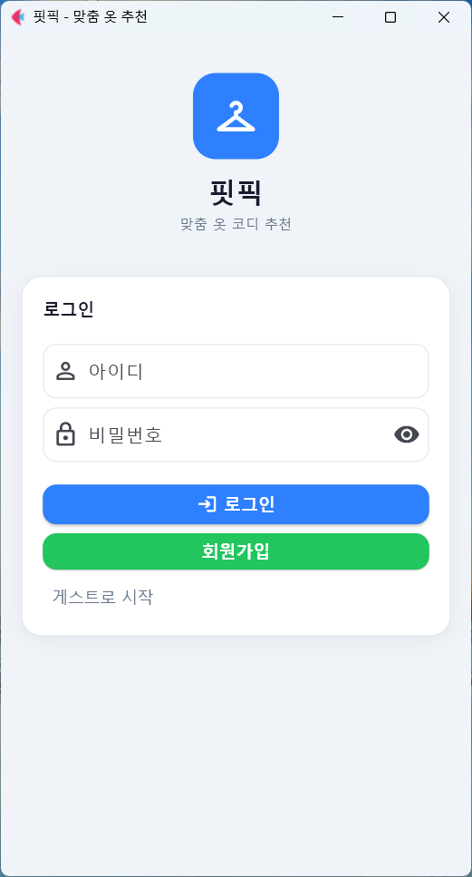

---

## 2. 로그인 및 회원가입

기존 계정이 있으면 아이디와 비밀번호를 입력한 뒤 **로그인** 버튼을 누릅니다.  
계정이 없으면 **회원가입**을 선택합니다. 간단히 체험하려면 **게스트로 시작**도 사용할 수 있습니다.


회원가입 시 성별, 키, 몸무게, 체형, 피부톤, 퍼스널 컬러를 입력할 수 있습니다.  
이 정보는 맞춤 코디 추천에서 사용됩니다.

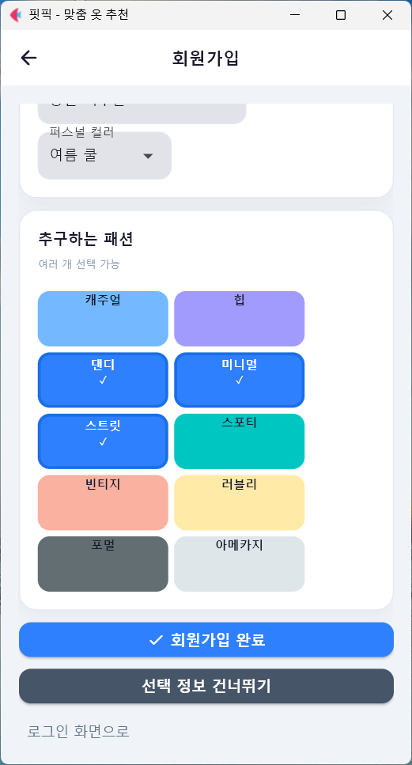

추구하는 패션은 여러 개 선택할 수 있습니다.  
예를 들어 캐주얼, 힙, 댄디, 미니멀, 스트릿 등을 선택할 수 있으며, 선택된 스타일은 추천 점수에 반영됩니다.

---

## 3. 홈 화면

로그인 후 홈 화면에서 등록된 옷 개수와 주요 기능을 확인할 수 있습니다.

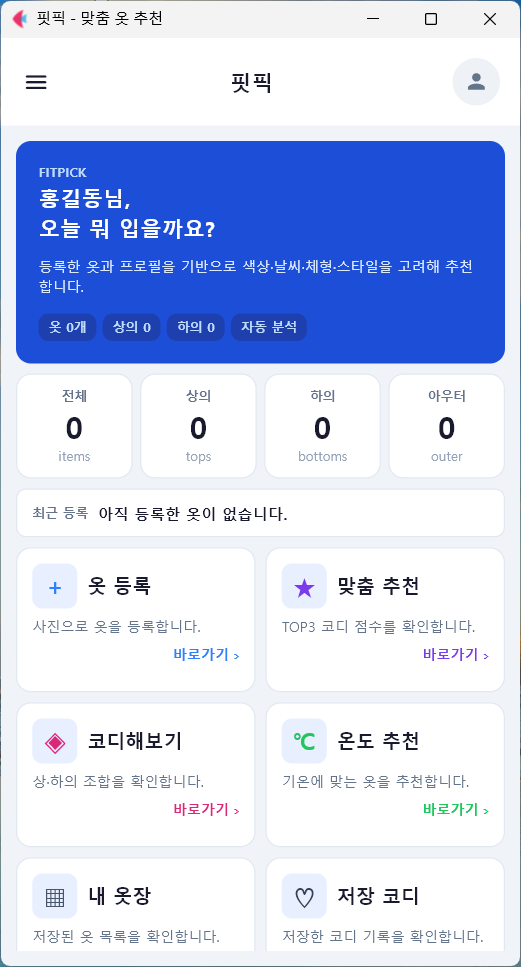

홈 화면의 주요 기능은 다음과 같습니다.

| 기능 | 설명 |
| --- | --- |
| 옷 등록 | 사진 또는 직접 입력으로 옷을 등록합니다. |
| 맞춤 추천 | 등록된 옷과 사용자 정보를 기반으로 코디를 추천합니다. |
| 코디해보기 | 사용자가 직접 옷을 선택해 코디를 구성합니다. |
| 온도 추천 | 현재 기온에 맞는 옷을 추천합니다. |
| 내 옷장 | 등록된 옷 목록을 확인합니다. |
| 저장 코디 | 저장한 코디를 다시 확인합니다. |

---

## 4. 메뉴 사용

왼쪽 위의 세 줄 모양 버튼은 **햄버거 메뉴**입니다.  
이 버튼을 누르면 주요 기능으로 이동할 수 있는 메뉴 창이 열립니다.

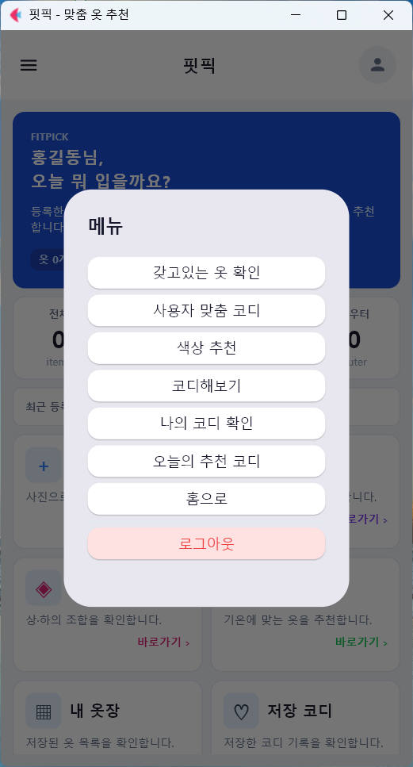

메뉴에서는 갖고있는 옷 확인, 사용자 맞춤 코디, 색상 추천, 코디해보기, 나의 코디 확인, 오늘의 추천 코디, 홈으로 이동, 로그아웃 기능을 사용할 수 있습니다.

---

## 5. 사용자 정보 확인

오른쪽 위 사용자 아이콘을 누르면 사용자 정보 화면으로 이동합니다.

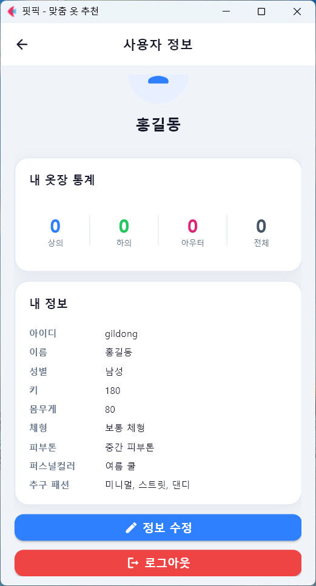

사용자 정보 화면에서는 아이디, 이름, 성별, 키, 몸무게, 체형, 피부톤, 퍼스널 컬러, 추구 패션, 내 옷장 통계를 확인할 수 있습니다.

---

## 6. 옷 등록

옷 등록은 **사진으로 등록**과 **직접 입력** 두 가지 방식으로 제공됩니다.

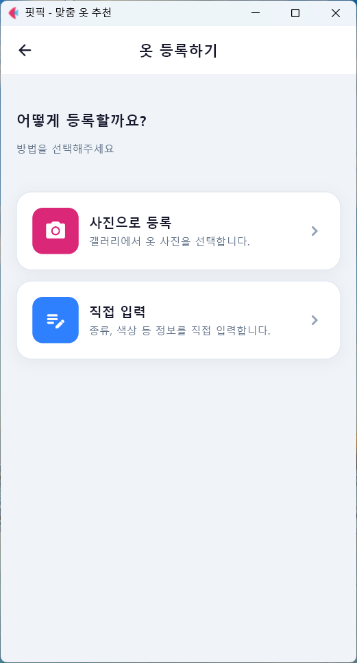

### 6.1 사진으로 등록

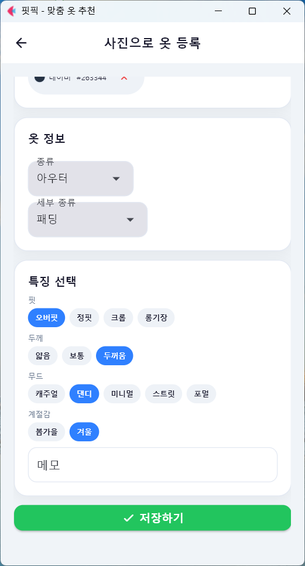

사진으로 등록할 때는 옷 사진을 선택한 뒤 종류, 세부 종류, 핏, 두께, 무드, 계절감 등을 입력합니다.  
입력한 정보는 추천 알고리즘에 활용됩니다.

#### 스포이트 색상 선택 영상

아래 영상은 사진 등록 과정에서 스포이트 기능을 이용해 옷의 대표 색상을 선택하는 과정을 보여줍니다.

[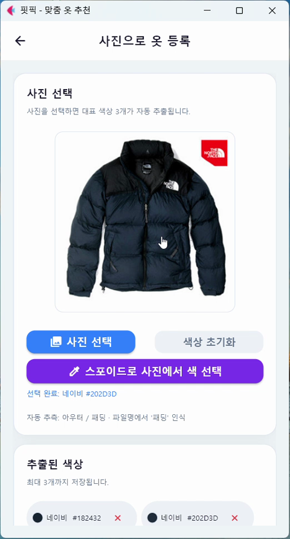](./videos/eyedropper-color-guide.mp4)

[스포이트 색상 선택 영상 보기](./videos/eyedropper-color-guide.mp4)

### 6.2 직접 등록

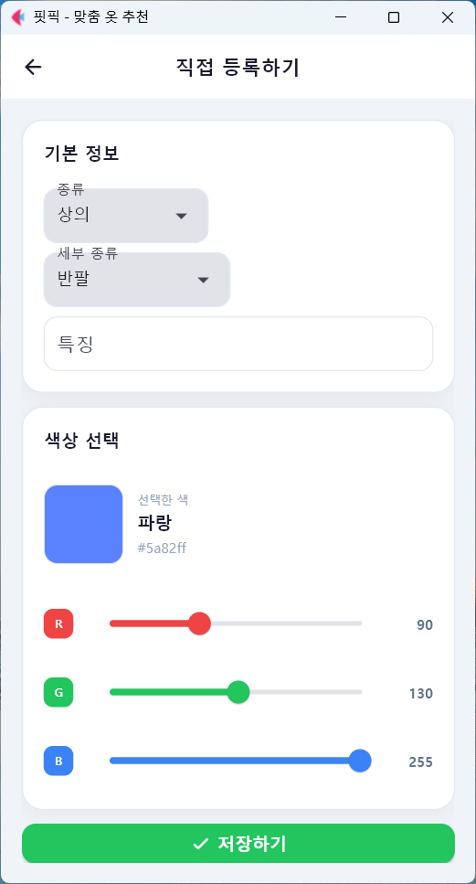

직접 등록에서는 옷 종류와 세부 종류를 선택하고, RGB 슬라이더를 통해 색상을 직접 지정할 수 있습니다.

---

## 7. 등록된 옷 확인

등록된 옷은 내 옷장 화면에서 확인할 수 있습니다.

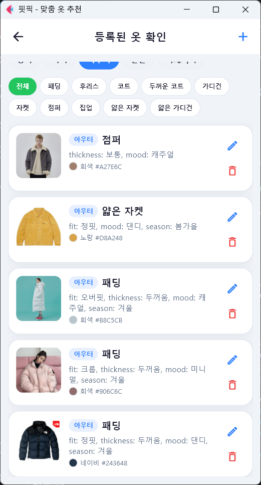

카테고리 필터를 이용해 전체, 상의, 하의, 아우터, 신발, 악세서리 등으로 나누어 볼 수 있습니다.  
각 옷 카드에는 이미지, 종류, 세부 종류, 특징, 색상 이름, HEX 코드가 표시됩니다.

---

## 8. 코디해보기

코디해보기에서는 사용자가 직접 상의, 하의, 아우터, 신발, 악세서리를 선택하여 코디를 만들 수 있습니다.

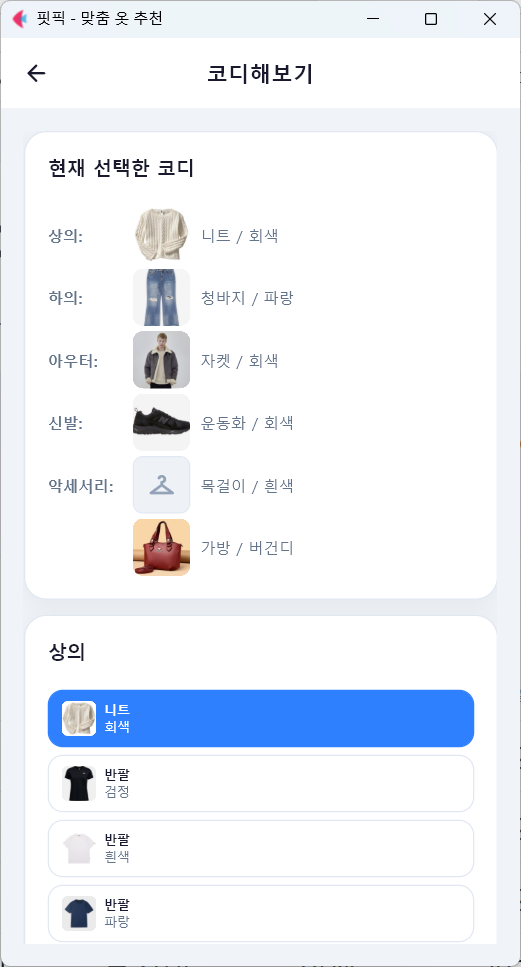

선택한 코디는 저장할 수 있으며, 저장 후 나의 코디 확인 화면에서 다시 볼 수 있습니다.

---

## 9. 맞춤 코디 추천

맞춤 코디 추천은 현재 기온과 상황을 기준으로 등록된 옷 중 적절한 코디를 추천합니다.

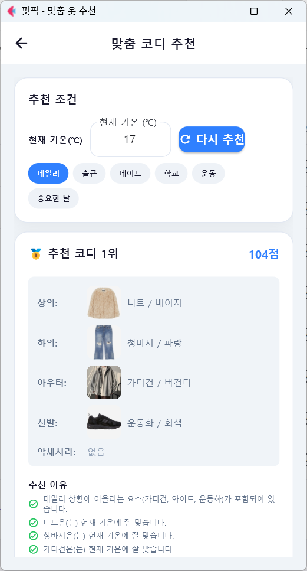

추천 결과는 점수와 함께 표시되며, 상의, 하의, 아우터, 신발, 악세서리 구성을 확인할 수 있습니다.

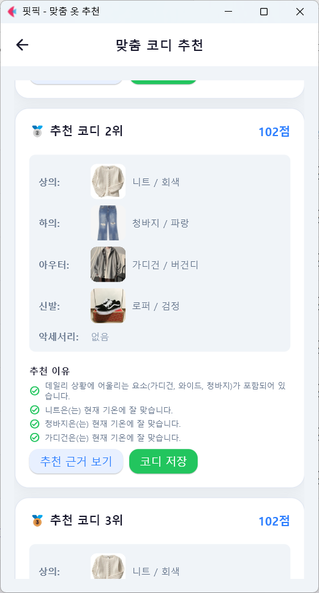

추천받은 코디가 마음에 들면 **코디 저장** 버튼을 눌러 저장할 수 있습니다.

---

## 10. 추천 근거 보기

추천 결과의 **추천 근거 보기** 버튼을 누르면 세부 평가 점수를 확인할 수 있습니다.

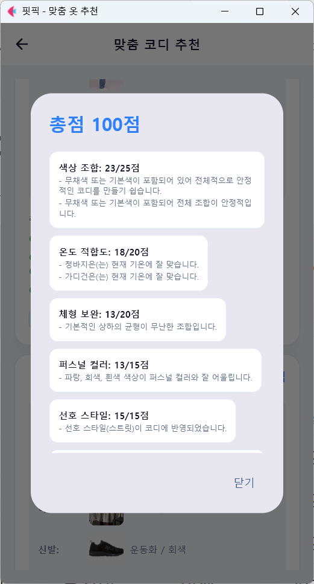

색상 조합, 온도 적합도, 체형 보완, 퍼스널 컬러, 선호 스타일 등의 항목이 표시됩니다.  
이를 통해 왜 해당 코디가 추천되었는지 확인할 수 있습니다.

---

## 11. 색상 기반 코디 추천

색상 기반 코디 추천은 선택한 옷의 색상을 기준으로 어울리는 색상 조합을 추천합니다.

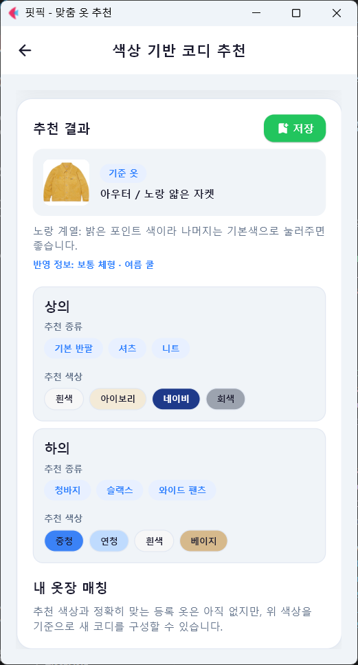

현재 옷장에 정확히 맞는 옷이 없더라도 추천 색상을 기준으로 새 코디 방향을 정할 수 있습니다.

---

## 12. 저장 코디 확인

저장한 코디는 나의 코디 확인 화면에서 볼 수 있습니다.

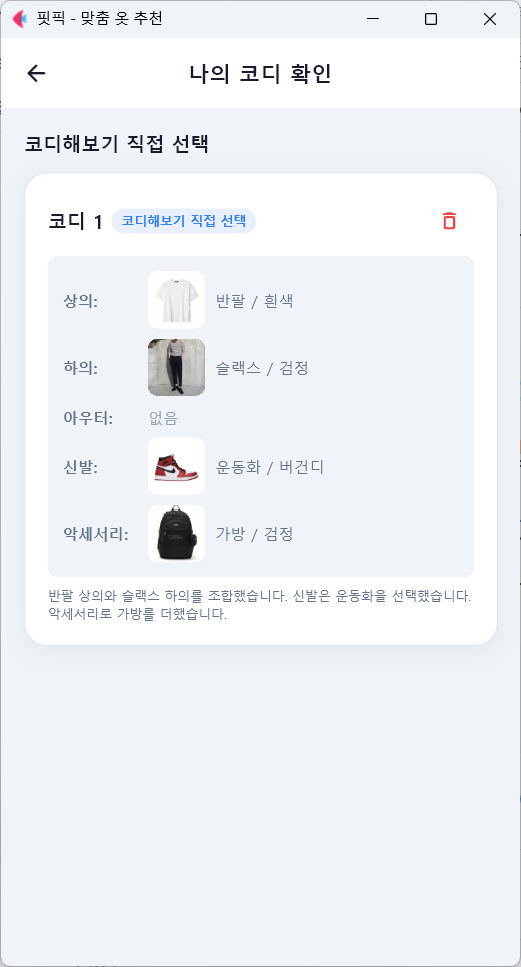

저장 코디 화면에서는 코디 출처, 상의, 하의, 아우터, 신발, 악세서리, 저장 이유를 확인할 수 있으며 필요 없는 코디는 삭제할 수 있습니다.

---

## 13. 전체 시연 영상

아래 영상은 FitPick 앱의 전체 사용 흐름을 보여줍니다.

[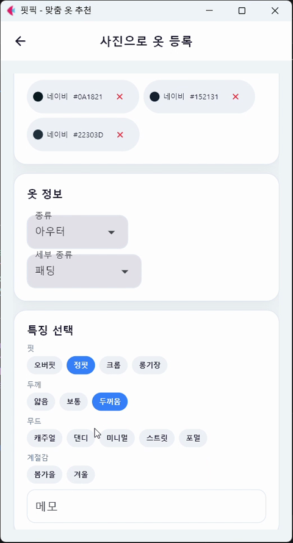](./videos/fitpick-demo.mp4)

[FitPick 전체 시연 영상 보기](./videos/fitpick-demo.mp4)

> GitHub 환경에서 영상이 바로 재생되지 않는 경우, 위 썸네일 또는 링크를 클릭해 확인할 수 있습니다.

---

## 14. 사용 팁

- 맞춤 추천을 사용하려면 상의와 하의를 최소 1개 이상 등록하는 것이 좋습니다.
- 핏, 두께, 무드, 계절감 정보를 자세히 입력할수록 추천 결과가 좋아집니다.
- 사진으로 등록한 옷 이미지는 앱 내부 이미지 폴더에 저장되므로 임의로 삭제하지 않는 것이 좋습니다.
- 추천 결과가 부족하면 옷을 더 등록한 뒤 다시 추천을 실행합니다.

---

## 15. 문제 해결

| 문제 | 해결 방법 |
| --- | --- |
| 앱이 실행되지 않음 | `pip install -r requirements.txt` 후 다시 실행합니다. |
| 로그인이 안 됨 | 아이디와 비밀번호를 확인하고, 회원가입이 완료되었는지 확인합니다. |
| 옷이 저장되지 않음 | 종류, 세부 종류, 색상, 이미지 선택 여부를 확인합니다. |
| 추천 결과가 안 나옴 | 상의와 하의를 먼저 등록합니다. |
| 저장 코디가 안 보임 | 저장 후 나의 코디 확인 화면에 다시 들어가거나 앱을 재실행합니다. |

---

## 사용자 가이드 요약

FitPick은 사용자가 등록한 옷과 프로필 정보를 기반으로 코디를 추천하는 앱입니다.  
옷을 많이 등록하고, 옷 특징과 사용자 정보를 자세히 입력할수록 더 적절한 추천을 받을 수 있습니다.
